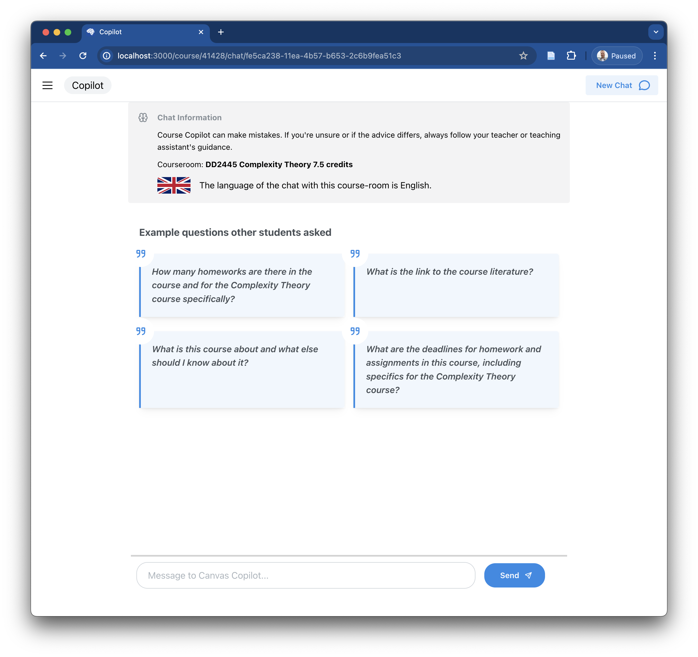
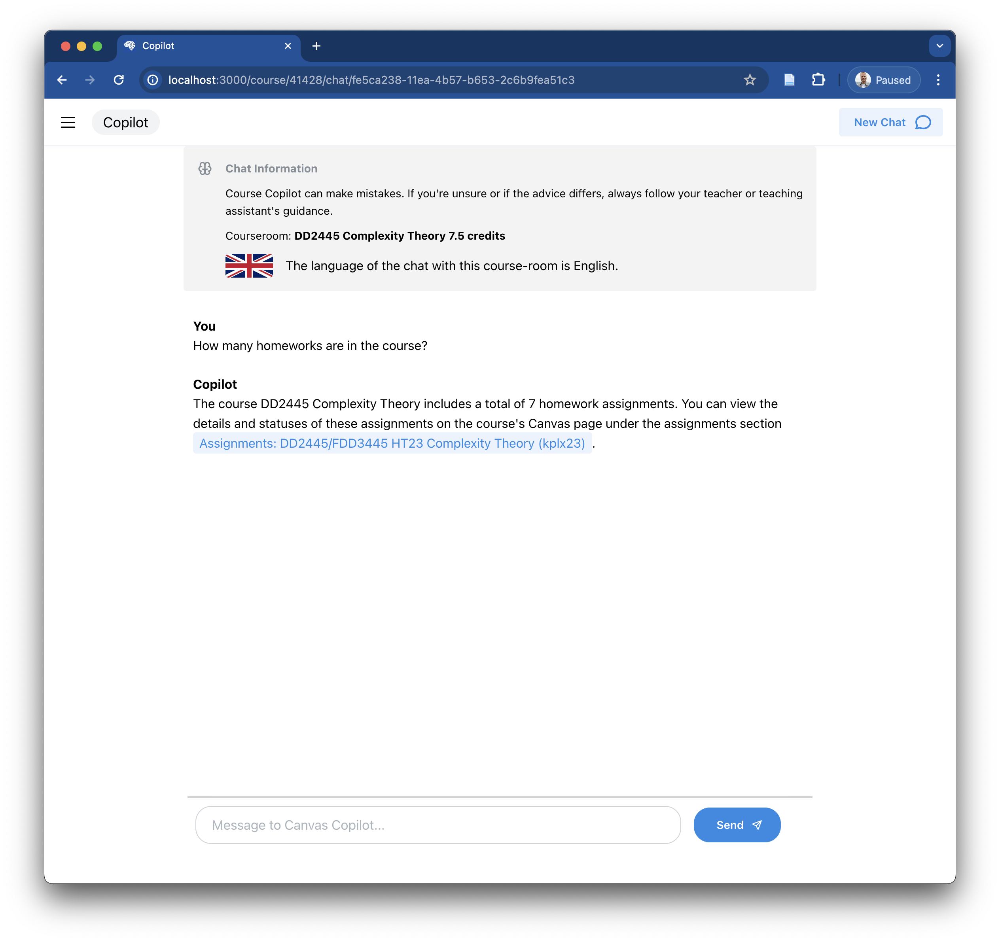

# KTH Assistant

This is a repository for the experiments that were conducted in my Master's thesis. The full report can be found at https://github.com/nattvara/DA231X.


- [KTH Assistant](#kth-assistant)
  - [About](#about)
  - [Usage](#usage)
    - [1. Prerequisites](#1-prerequisites)
    - [2. Download source code and dependencies](#2-download-source-code-and-dependencies)
    - [3. Configure environment](#3-configure-environment)
    - [4. Create database and seed with courses](#4-create-database-and-seed-with-courses)
    - [5. Configuring the crawler](#5-configuring-the-crawler)
    - [6. Start the LLM workers](#6-start-the-llm-workers)
    - [7. Start the queue workers](#7-start-the-queue-workers)
    - [8. Start the crawler](#8-start-the-crawler)
    - [8. Start the API api and UI](#8-start-the-api-api-and-ui)
  - [Test-suite](#test-suite)
  - [Screenshots](#screenshots)
    - [Chat view](#chat-view)
    - [An example reply](#an-example-reply)
    - [Landing page](#landing-page)
  - [License](#license)

## About

This project allows students to ask questions to their course rooms in canvas. The software was designed to run experiments on which RAG techniques and language models produce the highest student satisfaction on a number of metrics. A demo of the tool can be seen below

<a href="https://www.youtube.com/watch?v=spdZ4jwI8mo" target="_blank">
    
</a>

## Usage

### 1. Prerequisites

To run the tool locally you'll need the following things.

1. A KTH user with access to canvas
2. Have access to at least one course room
3. Have [docker installed](https://docs.docker.com/desktop/)
4. Python version 3.11.7 or above installed

### 2. Download source code and dependencies

Clone the repository with the following command

```bash
git clone https://github.com/nattvara/kth-assistant.git && cd kth-assistant
```

> Unless told otherwise, from this point onwards, all commands are executed from the root of the repository

Create a virtual environment and install the dependencies.

```bash
python -m venv venv
source venv/bin/activate
pip install -r requirements.txt
python setup.py develop
playwright install chromium
```

Using docker, start the following three containers.

```bash
# Start an opensearch instance with some password
docker run -p 9200:9200 -p 9600:9600 -e "discovery.type=single-node" -e "OPENSEARCH_INITIAL_ADMIN_PASSWORD=1d7c3bb07cce6d51fe6d5cd426A." --name kth-assistant-opensearch -d opensearchproject/opensearch:latest
```

```bash
# Start a redis cache
docker run --name kth-assistant-redis -d -p 6379:6379 -it redis/redis-stack:latest
```

```bash
# Start a postgres server
docker run --name kth-assistant-postgres -e POSTGRES_PASSWORD=postgres -d -p 5432:5432 postgres
```

### 3. Configure environment

Copy the example `.env` file

```bash
cp .env.example .env
```

Update the settings in the config file with appropriate values.

### 4. Create database and seed with courses

Create the database.

```bash
psql -h 127.0.0.1 -U postgres -c "CREATE DATABASE kthassistant;"
```

Run the database migrations.

```bash
migrate_up
```

Create a course.

```bash
psql -h 127.0.0.1 -U postgres -d kthassistant -c "INSERT INTO courses (id, created_at, modified_at, canvas_id, snapshot_lifetime_in_mins, max_allowed_crawl_distance, language, name, description, admin_token, extra_urls) VALUES (1, NOW(), NOW(), 41428, 60, 1, 'en', 'DD2445 Complexity Theory 7.5 credits', 'A description', 'some-pass', '[]');"
```

### 5. Configuring the crawler

Insert the cookie of a kth user. This should be the entire cookie header used to access [canvas.kth.se](https://canvas.kth.se).

```bash
psql -h 127.0.0.1 -U postgres -d kthassistant -c "INSERT INTO cookies (identifier, created_at, modified_at, value) VALUES ('le-cookie', NOW(), NOW(), 'klaro=...; _csrf_token=...; canvas_session=...');"
```

### 6. Start the LLM workers

Depending on how the system is configured you may need to start several llm workers. The configuration depends upon what experiments are being executed. For this guide, we'll use OpenAIs GPT-4 for the language model only, and index the course room using `Salesforce/SFR-Embedding-Mistral` and `openai/text-embedding-3-large`.

Start the `openai/gpt4` worker

```bash
llm_worker OPENAI_GPT4 _
```

Start the worker for `openai/text-embedding-3-large`

```bash
llm_worker OPENAI_TEXT_EMBEDDING_3_LARGE _
```

Start the worker for `Salesforce/SFR-Embedding-Mistral`. This will download the model from huggingface and load it into memory.

```bash
llm_worker SALESFORCE_SFR_EMBEDDING_MISTRAL cpu
```

### 7. Start the queue workers

This project uses [RQ](https://python-rq.org/) for some background tasks. To start the necessary worker nodes, run the following commands

> **NOTE:** on MacOS the following has to be set for RQ to work
> ```bash
> export OBJC_DISABLE_INITIALIZE_FORK_SAFETY=YES
> ```

Start the crawler and snapshot queue workers. These run the jobs that take create snapshots of courses, and crawl their urls.

```bash
rq worker --with-scheduler --url="redis://:@127.0.0.1:6379" crawler snapshots
```

Start the index queue worker. This queue takes jobs that index the content found in course rooms.

```bash
rq worker --with-scheduler --url="redis://:@127.0.0.1:6379" index
```

### 8. Start the crawler

There are two ways of starting the crawler. The first method is by starting the HTTP API, which will be done later. This also triggers the crawler to start, but for the purposes of this guide, we'll run the following command

```bash
restart_queues
```

The crawler should now start crawling the configured courses, in this case the only course that's been added. It should create indexing jobs that index each piece of content in that course room.

Crawling and indexing can take a while.

### 8. Start the API api and UI

To start the chat interface we need to boot the HTTP and Websocket server.

```bash
uvicorn http_api:main --reload
```

The rest api should now be available on `localhost` port `8000`. The following command should produce the following output

```bash
curl localhost:8000/health | jq
> {
>   "database": "db is working fine.",
>   "redis": "redis is working fine.",
>   "search_index": "search index is working fine."
> }
```

Install the frontend dependencies

```bash
cd gui
yarn install
```

Start the frontend server

```bash
yarn run dev
```

The frontend should now be available at [http://localhost:3000](http://localhost:3000). This should now look something like what can be seen at [the screenshot of the landing page](#landing-page).

To chat with the course that was crawled, go to the following url [http://localhost:3000/course/41428](http://localhost:3000/course/41428) in the browser. For another course room simply update the url with the canvas room id.

> **NOTE:** the crawler needs to completely finish its first snapshot for the chat to work

## Test-suite

To run the applications test-suite, run the following command from the root of the repository.

```console
$ pytest
========================= test session starts ==========================
collected 102 items

tests/db/migrations/test_migrations.py ..                        [  1%]
tests/db/models/test_prompt_handle.py .....                      [  6%]
tests/http_api/admin_test.py .                                   [  7%]
tests/http_api/chat_test.py .................                    [ 24%]
tests/http_api/feedback_test.py ..                               [ 26%]
tests/http_api/health_test.py ....                               [ 30%]
tests/http_api/session_test.py .........                         [ 39%]
tests/http_api/test_index.py .                                   [ 40%]
tests/jobs/crawl/start_crawler_worker_test.py ..                 [ 42%]
tests/jobs/snapshot/capture_snapshots_test.py ...                [ 45%]
tests/services/chat/chat_service_test.py ......                  [ 50%]
tests/services/crawler/crawler_test.py .....................     [ 71%]
tests/services/download/download_test.py .......                 [ 78%]
tests/services/index/index_test.py ...                           [ 81%]
tests/services/llm/llm_test.py ..........                        [ 91%]
tests/services/llm/worker_test.py .........                      [100%]

=================== 102 passed, 41 warnings in 7.71s ===================
```

## Screenshots

### Chat view



The view a user get's before they send the assistant any messages.

### An example reply



An example reply to a user question.

### Landing page


The landing view of the application.

## License

MIT © Ludwig Kristoffersson

See [LICENSE file](LICENSE) for more information.
